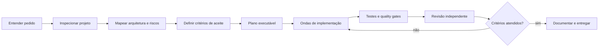

<div align="center">

# Matte AI Coding Toolkit

### Um workflow prático para desenvolver software com agentes de IA — com Codex como experiência principal.

[](LICENSE)
[](https://openai.com/codex/)
[](#)
[](#)

</div>

---

## O que é

O **Matte AI Coding Toolkit** é um conjunto de regras, playbooks, prompts e templates para transformar agentes de IA em parte previsível do fluxo de desenvolvimento.

A proposta não é "colar um prompt enorme e torcer". O fluxo força o agente a entender o projeto existente, definir critérios de aceite, planejar, implementar em etapas controladas, testar, revisar e só então considerar a tarefa concluída.

```text
Entender → Mapear → Planejar → Delegar → Implementar → Testar → Revisar → Validar → Registrar
```

O toolkit é **Codex-first**, mas os princípios são compatíveis com outros agentes que consigam ler instruções do repositório, executar comandos e trabalhar com Git.

## Princípio central

> Código escrito não é sucesso. Comportamento validado é sucesso.

Uma tarefa só pode ser considerada concluída quando, quando aplicável:

- implementação concluída;
- comportamento real testado;
- regressões verificadas;
- lint aprovado;
- typecheck aprovado;
- testes aprovados;
- build de produção aprovado;
- UI revisada visualmente;
- evidências apresentadas;
- documentação e decisões atualizadas.

## Fluxo principal



## Estrutura

```text
Matte-AI-Coding-Toolkit/
├── AGENTS.md                    regras globais para agentes
├── README.md
├── LICENSE
├── NOTICE.md
├── docs/
│   ├── 00-overview.md
│   ├── 01-installation.md
│   ├── 02-playbook.md
│   ├── codex/
│   │   ├── codex-workflow.md
│   │   ├── agents.md
│   │   └── mcp.md
│   └── workflows/
│       ├── new-project.md
│       ├── existing-project.md
│       ├── bug-fix.md
│       ├── ui-rebuild.md
│       ├── production-release.md
│       └── code-review.md
├── prompts/
│   ├── build-project.md
│   ├── inspect-project.md
│   ├── fix-bug.md
│   ├── ui-ux-review.md
│   ├── production-audit.md
│   └── release-checklist.md
└── templates/
    ├── AGENTS.md
    ├── PROJECT.md
    ├── ARCHITECTURE.md
    ├── DECISIONS.md
    └── TODO.md
```

## Como usar

### Projeto existente

1. Leia [`docs/workflows/existing-project.md`](docs/workflows/existing-project.md).
2. Copie [`templates/AGENTS.md`](templates/AGENTS.md) para a raiz do projeto e adapte.
3. Use [`prompts/inspect-project.md`](prompts/inspect-project.md) para iniciar a primeira auditoria.
4. Não permita implementação antes do agente mapear arquitetura, estado atual, riscos e critérios de aceite.

### Projeto novo

1. Leia [`docs/workflows/new-project.md`](docs/workflows/new-project.md).
2. Preencha `PROJECT.md` e `ARCHITECTURE.md`.
3. Use [`prompts/build-project.md`](prompts/build-project.md).
4. Exija entregas incrementais verificáveis em vez de um único salto até "pronto".

### Bugs

Use [`docs/workflows/bug-fix.md`](docs/workflows/bug-fix.md) e [`prompts/fix-bug.md`](prompts/fix-bug.md). O fluxo exige reprodução antes da correção e teste de regressão depois dela.

### Produção

Antes de publicar, use [`docs/workflows/production-release.md`](docs/workflows/production-release.md) e [`prompts/release-checklist.md`](prompts/release-checklist.md).

## Regras que não se negociam

- Não reescrever arquitetura sem primeiro entender a existente.
- Não apagar comportamento funcional para simplificar implementação.
- Não declarar sucesso com base apenas em compilação.
- Não esconder warnings, falhas ou testes ignorados.
- Não fazer mudanças destrutivas sem necessidade clara e evidência.
- Não misturar exploração, implementação e revisão como se fossem a mesma etapa.
- Não usar múltiplos agentes no mesmo arquivo simultaneamente sem coordenação explícita.
- Não criar abstração só porque "parece mais profissional".
- Não usar produção como ambiente de teste quando houver alternativa segura.
- Não deixar decisões importantes existirem apenas no histórico do chat.

## Filosofia de agentes

O agente principal deve atuar como **orquestrador** quando a tarefa for grande: entende o sistema, decompõe o problema, define fronteiras e coordena revisões.

Subagentes ou agentes especializados são úteis para tarefas independentes como arquitetura, banco de dados, segurança, testes, performance, UI/UX, revisão de código e documentação.

Paralelismo só é usado quando duas tarefas não disputam os mesmos arquivos, estados ou decisões.

## Quality gates

Cada projeto deve definir seus próprios comandos reais. Como padrão conceitual:

```text
format/lint
    ↓
typecheck
    ↓
testes unitários
    ↓
testes de integração
    ↓
build de produção
    ↓
smoke test / E2E quando aplicável
```

Nenhuma etapa deve ser marcada como aprovada se foi pulada sem justificativa explícita.

## Memória de projeto

O contexto importante deve sobreviver à sessão do agente. Para isso, o toolkit usa arquivos simples e versionáveis:

- `PROJECT.md` — objetivo, escopo e restrições;
- `ARCHITECTURE.md` — desenho atual e invariantes;
- `DECISIONS.md` — decisões técnicas relevantes;
- `TODO.md` — trabalho aberto e próximos passos;
- `AGENTS.md` — regras operacionais para agentes.

A memória do chat ajuda. A memória do repositório governa.

## Créditos e origem

Este projeto foi inspirado e derivado do **Vibe Coding Toolkit**, de Matheus Gomes (`soumatheusgomes/vibe-coding-toolkit`), distribuído sob a MIT License.

O Matte AI Coding Toolkit reorganiza e expande a proposta com foco em Codex-first, governança explícita via `AGENTS.md`, workflows orientados a critérios de aceite, inspeção obrigatória de projetos existentes, revisão visual para UI, release gates e documentação persistente de arquitetura e decisões.

Consulte [`NOTICE.md`](NOTICE.md) para atribuição completa.

## Licença

MIT. Consulte [`LICENSE`](LICENSE).
